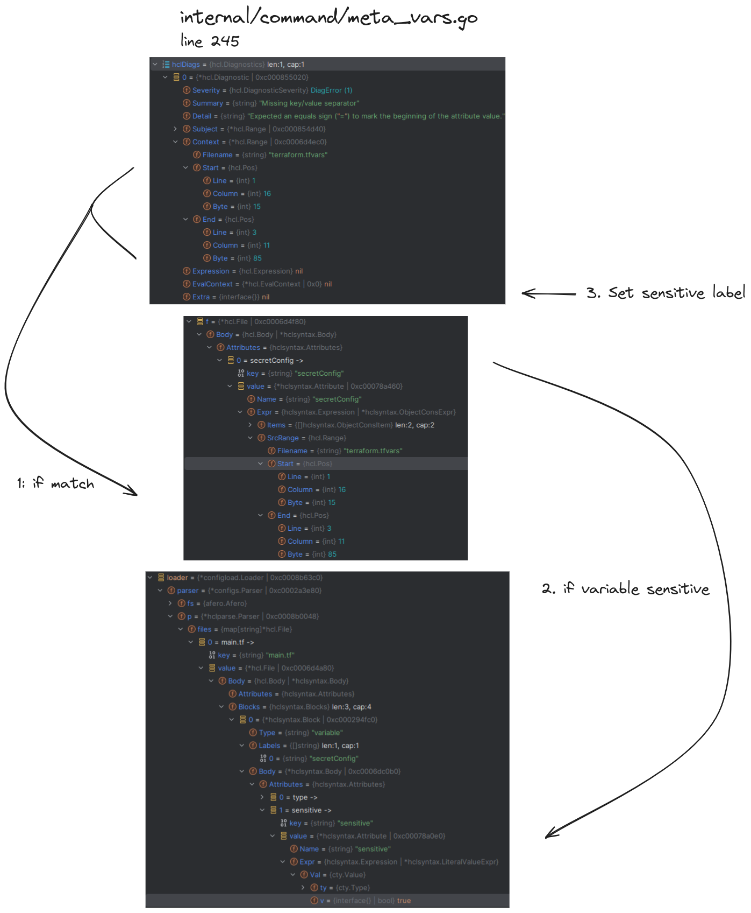

# Report for assignment 4

## Project

Name: Terraform

URL: https://github.com/Lussebullen/terraform

Terraform is an infrastructure as code tool that allows you to provision infrastructure at
most large cloud providers using a unified interface.

## Onboarding experience

We decided to choose a new project.

Terraform is a large source-available project that can be used commercially but not resold commercially. It is a mature codebase, and the “getting started” process is smooth and documented.

There is a README, and an introduction as well as further instructions that are provided on their website. They have getting started guides, and also link to pages on their website that describe how to contribute and develop Terraform.

### MacOS

The terraform onboarding was without any issues just like docker. The instructions to install and build the project were concise and exact.

To build the binary inside your `~/go/bin` folder you just have to cd to the root of the project and run  `go install .`

To test `go test -v ./...`

To run `go run . args.

### WSL
Compared to Docker, Terraform is not able to be installed with sudo apt-get install docker. Instead, their instructions to add Terraform as a package to install need to be followed. It installed without any issues.

To be able to test parts of the code and attempt to solve the issue, the repository was cloned. Then, ```go build``` was run to build.

### Tools needed

In order to actually use Terraform, one needs access to a cloud service such as AWS or similar. Since I (Emil) do not have access to this, I can not fully test Terraform. 
In order to build the project locally, Go needs to be installed.

### Were those tools well documented?

How to use AWS and other similar services is well documented, and how to integrate it into Terraform is also well documented.
Installing Go is well documented and installed without issues.

### Were other components installed automatically by the build script?

There were a bunch of components installed by the build script. They were related to the functionality of Terraform.

### Did the build conclude automatically without errors?

No. When installing Go from the terminal, the wrong version was installed. 
I got the following issue: ```build github.com/hashicorp/terraform: cannot load crypto/ecdh: malformed module path "crypto/ecdh": missing dot in first path element```.

By manually removing Go from my WSL installation, and installing the correct version (1.21.5) it gave the following output: 
```
go: updates to go.mod needed; to update it:
    	go mod tidy
```

After running the command, the build took a long time but finished without errors.

Running tests took ages, and had a few failures if run with -v for verbose. If not, it simply reported “pass”.

### Replicating issue

Following the descriptions in the first chosen issue, two files were created.

main.tf contains
```
variable secretConfig {
  type = map(any)
  sensitive = true
}
```

terraform.tfvars contains
```
secretConfig = { "something" = "extremely confidential", "oops" }
```

When then running ```terraform init``` followed by ```terraform plan``` the error was replicated just like the issue described.

## Effort spent

To see time spent for each group member in different tasks, see the relevant time tables where work done and time taken is logged.

## Overview of issue(s) and work done.

Title:  *Sensitive data is exposed when a variable is malformed #31946*

URL: https://github.com/hashicorp/terraform/issues/31946

When there is a syntax error in a .tfvar file the Go compiler error will be printed, even if the variable is labeled sensitive. This is undesirable as it can lead to security issues.

The logging functionality is affected, and since logging is tied to the Diagnostics module, which can be referenced from a multitude of locations in the codebase, it potentially affects the security of many functions throughout the code-base, since it leaks sensitive information. We have identified two such functions, namely ```terraform plan``` and ```terraform apply```.
There could be more such issues throughout the codebase, but it is easier to deal with the issue at its root than it is to identify all downstream vulnerabilities.

## Requirements for the new feature or requirements affected by functionality being refactored

### Name: Sensitive information

Title: Mark sensitive information as sensitive
Terraform allows users to configure their terraform plan (stated in a .tf file) to use variables stated in a .tfvars file. The plan file (.tf) currently allows a `sensitive` tag on variables assigned in the variable declaration file (.tfvars). If variables are incorrectly formatted in the (.tfvars) file. A requirement is that, if the variable is declared as `sensitive` then the error printed by handler should redact this information, such that no sensitive information will be displayed in text through error output.

### Name: Functionality

Title: Maintain proper handling of existing code and functionality
The implemented solution should have the requirement to not cause any other functionality in the code base to work or have a changed functionality. This means that the way the issue is solved must not cause affected modules to behave in an incorrect way somewhere else in the code.

### Name: Simplicity

Title: Try to minimize the invasiveness of the solution
The solution requires that it does not unnecessarily increase the complexity of the project. Sometimes it is unavoidable to add complexity to solve an issue, but in all cases the added complexity should be kept to a minimum. This ensures the longevity of the project, and prevents software rot, making maintenance of the project easier in the long run.

### Name: Testability

Title: Ensure issue and solution can be tested
To show that there is an issue, tests should be able to be created, and should be created. The tests should fail on the issue when it is not solved. Equally as important is that the tests pass when the patch is implemented. This ensures other developers can see proof that there is an issue, a way to replicate it, and that the solution works in the relevant test cases.

### Name: Standardization

Title: Follow project instructions regarding code and contributions
Since Terraform is a large project with many contributors, there are established standards for code writing and testing. To ensure maximum readability of the code as well as the health of the project in the long run, these standards are enforced. In order to contribute to a solution, a requirement of the contribution is thus to follow those standards.

## Code changes

### Patch

```bash
diff --git a/internal/command/apply_test.go b/internal/command/apply_test.go
index 22497a7b6..3558c0004 100644
--- a/internal/command/apply_test.go
+++ b/internal/command/apply_test.go
@@ -695,6 +695,49 @@ func TestApply_plan(t *testing.T) {
 	}
 }
 
+// Test that sensitive variables are redacted in diagnostic output.
+func TestApply_varsSensitive(t *testing.T) {
+	// Create a temporary working directory that is empty
+	td := t.TempDir()
+	testCopyDir(t, testFixturePath("apply-sensitive"), td)
+	defer testChdir(t, td)()
+
+	p := planVarsFixtureProvider()
+	view, done := testView(t)
+	c := &ApplyCommand{
+		Meta: Meta{
+			testingOverrides: metaOverridesForProvider(p),
+			View:             view,
+		},
+	}
+
+	args := []string{
+		"-var-file", "sensitiveVar.tfvars",
+	}
+	code := c.Run(args)
+	output := done(t)
+
+	if code != 1 {
+		t.Errorf("expected status code 1 but got %d", code)
+	}
+
+	expected := `╷
+│ Error: Missing key/value separator
+│ 
+│   on sensitiveVar.tfvars line 3:
+│    (SENSITIVE)
+│ 
+│ Expected an equals sign ("=") to mark the beginning of the attribute value.
+╵
+`
+
+	actual := output.All()
+
+	if diff := cmp.Diff(actual, expected); len(diff) > 0 {
+		t.Errorf("output didn't match expected:\nexpected:\n%s\nactual:\n%s\ndiff:\n%s", expected, actual, diff)
+	}
+}
+
 func TestApply_plan_backup(t *testing.T) {
 	statePath := testTempFile(t)
 	backupPath := testTempFile(t)
diff --git a/internal/command/plan_test.go b/internal/command/plan_test.go
index 12643e565..c50887fba 100644
--- a/internal/command/plan_test.go
+++ b/internal/command/plan_test.go
@@ -7,6 +7,7 @@ import (
 	"bytes"
 	"context"
 	"fmt"
+	"github.com/google/go-cmp/cmp"
 	"io/ioutil"
 	"os"
 	"path"
@@ -733,6 +734,49 @@ func TestPlan_vars(t *testing.T) {
 	}
 }
 
+// Test that sensitive variables are redacted in diagnostic output.
+func TestPlan_varsSensitive(t *testing.T) {
+	// Create a temporary working directory that is empty
+	td := t.TempDir()
+	testCopyDir(t, testFixturePath("plan-sensitive"), td)
+	defer testChdir(t, td)()
+
+	p := planVarsFixtureProvider()
+	view, done := testView(t)
+	c := &PlanCommand{
+		Meta: Meta{
+			testingOverrides: metaOverridesForProvider(p),
+			View:             view,
+		},
+	}
+
+	args := []string{
+		"-var-file", "sensitiveVar.tfvars",
+	}
+	code := c.Run(args)
+	output := done(t)
+
+	if code != 1 {
+		t.Errorf("expected status code 1 but got %d", code)
+	}
+
+	expected := `╷
+│ Error: Missing key/value separator
+│ 
+│   on sensitiveVar.tfvars line 3:
+│    (SENSITIVE)
+│ 
+│ Expected an equals sign ("=") to mark the beginning of the attribute value.
+╵
+`
+
+	actual := output.All()
+
+	if diff := cmp.Diff(actual, expected); len(diff) > 0 {
+		t.Errorf("output didn't match expected:\nexpected:\n%s\nactual:\n%s\ndiff:\n%s", expected, actual, diff)
+	}
+}
+
 func TestPlan_varsInvalid(t *testing.T) {
 	testCases := []struct {
 		args    []string
diff --git a/internal/command/testdata/apply-sensitive/main.tf b/internal/command/testdata/apply-sensitive/main.tf
new file mode 100644
index 000000000..4be511b91
--- /dev/null
+++ b/internal/command/testdata/apply-sensitive/main.tf
@@ -0,0 +1,4 @@
+variable secretConfig {
+  type = map(any)
+  sensitive = true
+}
\ No newline at end of file
diff --git a/internal/command/testdata/apply-sensitive/sensitiveVar.tfvars b/internal/command/testdata/apply-sensitive/sensitiveVar.tfvars
new file mode 100644
index 000000000..6bbd48981
--- /dev/null
+++ b/internal/command/testdata/apply-sensitive/sensitiveVar.tfvars
@@ -0,0 +1,3 @@
+secretConfig = { "something" = "extremely confidential",
+		"key" = "val",
+		"oops" }
\ No newline at end of file
diff --git a/internal/command/testdata/plan-sensitive/main.tf b/internal/command/testdata/plan-sensitive/main.tf
new file mode 100644
index 000000000..4be511b91
--- /dev/null
+++ b/internal/command/testdata/plan-sensitive/main.tf
@@ -0,0 +1,4 @@
+variable secretConfig {
+  type = map(any)
+  sensitive = true
+}
\ No newline at end of file
diff --git a/internal/command/testdata/plan-sensitive/sensitiveVar.tfvars b/internal/command/testdata/plan-sensitive/sensitiveVar.tfvars
new file mode 100644
index 000000000..6bbd48981
--- /dev/null
+++ b/internal/command/testdata/plan-sensitive/sensitiveVar.tfvars
@@ -0,0 +1,3 @@
+secretConfig = { "something" = "extremely confidential",
+		"key" = "val",
+		"oops" }
\ No newline at end of file

```

Optional (point 4): the patch is clean.

The patch is non-breaking, although it doesn't include code to fix the issue that we test for. So both of the two new tests fail, revealing the lack of a solution to the sensitivity issue.

## Test results

To see test logs, check relevant folder in Google Drive.

## UML class diagram and its description


### Key changes/classes affected

Optional (point 1): Architectural overview.

The root of the problem starts in the function `addVarsFromFile` in file `meta_vars.go`. It's purpose is to parse and load the variables from the `.tf` and `.tfvars` files. The object `loader` a pointer to type `configload.Loader` is a config loader with methods to parse
the the the variables with `loader.Parser().ForceFileSource(filename, src)`. This method parses all relevant files inside the working directory and loads them to the `loader` object in a structured manner, such as file name and file contents and other variables. Afer this is done a pointer variable `f` of type `hcl.File` and `diags` of type `tfdiags.Diagnostic` is declared. `f` contains the structured content of the file that has been parsed while diags is an array of potential diagnostics. These two variables will be given the respective values of the function call `hclsyntax.ParseConfig(src, filename, hcl.Pos{Line: 1, Column: 1})`, which will return two values, one for `f` and one for `diags`. If the parsed file contains any errors it will be listed in `diags` and that is where only the location in the file of the variables is set and the `diags` is also what gets returned from this function `addVarsFromFile`. This function is getting is getting called by `collectVariableValues` that is in turn called by `GatherVariables` which both are in `plan.go` which. And what we get back from the function is `diags` and if the `diags` array is not empty it calls a `view.Diagnostics(diags)` which is in `views.go` and prints the error. It does not take the sensitive variable in account at all and just prints out the content between the start and end locations of the content in the file. 

See the below image for an overview of how to set the sensitive label for later redacting.



After setting the sensitive label in diags, we need to ensure that these diags are redacted when output. See the below image for an overview of how this should be done.


## Overall experience

What are your main take-aways from this project? What did you learn?

Our main take-away is that solving issues and developing features on a large project such as Terraform is very difficult.
We discussed in the group, and we now have a greater understanding why companies sometimes are desparate to keep their senior developers. It took us a long time to understand just a small part of the code, and we did not succeed in solving the issue. For a developer with a greater knowledge of the codebase it might be solveable, and in shorter time. After a week of work from five people it was still not clear how we should solve the issue. This explains why companies value their experienced developers so highly.

Additionally, getting someone versed in the codebase is very difficult and time consuming. When a new hire or consultant is expected to understand the code, it must take a long time for them to understand it sufficiently. It is interesting that this is still something companies expect and are OK with, even though it might be a whole month or more of just trying to understand what the code is doing and how its structured.

Sometimes we found it interesting that some project have hundreds of issues. After attempting to solve one, we understand why some seemingly easy issues are left for a long while with no-one touching them. This explains the buildup.

We also understood how important documentation is. Docker had better documentation that Terraform, and while Terraform was not lacking in documentation completely, it was not sufficient for us to easily understand the codebase enough to solve the issue. Additionally, Terraform has dedicated documentation contributors, and it was still lacking at times. Perhaps it is very difficult to expect such a large project to have great documentation. 

## Essence Analysis (Team)
When doing the essence team analysis in earlier assignments, the team positioned itself somewhere between performing and collaborating. The requirement that we did not achieve was the `Wasted work and the potential for wasted work are continuously identified and eliminated`. Due to the ever-changing nature of the assignments, all our efforts were put into solving the issue at hand and little to no time was given to reflect upon the finished work. 

For this assignment, the time frame was more generous, which in turn allowed more discussions to take place before dividing up the work. This led to the team having an opportunity to reform our workflow to be better suited, come hell or high waters. Changes involved, including scheduled breaks, and preemptively avoid wasted work by thoroughly analyzing the assignment and issues to be resolved. An example of this is how the team discovered that some of the initially assigned tasks required the same base work to be done. In order to avoid performing the same work multiple times, this was addressed, and those parts could be worked on together before splitting up the work further. The team now positions itself as `performing` and adapts to contextual changes while meeting commitments without outside help. 

## Optional essence analysis (P+)
The semat essence guide is made to be generally applicable in any sw-project, and hence it is difficult to pinpoint where the team would place itself across several alphas. E.g. the `Stakeholder` alpha suggests that a given task has a one or more groups of stakeholders, Even though we could view the course examiner as stakeholder for the assignments, the assignment is not really as vague or broad as a `business opportunity` and so analyzing this alpha, strikes as overkill in regard to the scope of any individual assignment. 

For the purpose of learning the different parts that are involved in a sw-project, the Essence Kernel is a great tool, but with the short time frames for the assignments, it feels like a stretch to apply all alphas, since most of the time needs to be devoted to hands-on work.

The whole Essence Kernel covers three separate parts, Customer, Solution and Endeavor, and  while it is easy to see that all alphas serve a purpose, some alphas could be more relevant than others depending on the project. In our case, the Endeavor alphas were relevant because of the nature of the assignments.

When thrown in a group with engineers, a natural focus revolves around technical problem-solving. However, in a group of humans, communication, group dynamics and trust will always play a part in how well the group performs. The Essence Kernel is a great tool to make sure that the whole team is on the same page. The `being-on-the-same-page` dilemma can otherwise be an issue that, if not managed correctly, might lead to unnecessary friction in the team.


Optional (point 6): How would you put your work in context with best software engineering practice?

Optional (point 7): Is there something special you want to mention here?